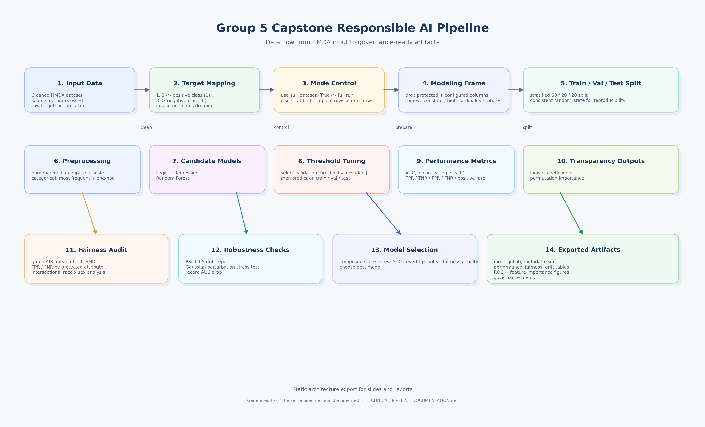

# Group 5 Capstone: Full Technical Pipeline Documentation

## 1. Purpose and Scope

This document describes the complete data + model pipeline implemented for the HMDA Responsible AI capstone project.

Scope includes:
- Data input assumptions and target construction
- Sampling mode behavior (full dataset vs stratified sample)
- Feature engineering and preprocessing
- Model training, thresholding, evaluation, fairness, robustness, and transparency
- Model selection logic
- Artifact outputs and governance memo generation
- Reproducibility and operational guidance

Primary implementations:
- Notebook workflow: `notebooks/Group_5_Capstone_Full_Pipeline.ipynb`
- Script workflow: `scripts/run_capstone_pipeline.py`

---

## 2. High-Level Architecture

### 2.1 Architecture Diagram

The static export is available in both vector and raster formats:

- [PNG architecture diagram](architecture_pipeline.png)
- [SVG architecture diagram](architecture_pipeline.svg)



The diagram is intentionally organized as a left-to-right flow with three stages:
- Data preparation and mode control on the top row
- Core modeling and evaluation in the middle row
- Responsible AI checks and export artifacts on the bottom row

### 2.2 Processing Layers

- Data layer: load and target mapping
- Control layer: mode switch and sampling
- Feature layer: preprocessing-safe modeling frame
- Modeling layer: two candidate models + optimized threshold
- Responsible AI layer: fairness, robustness, interpretability
- Selection layer: composite score with fairness penalty
- Output layer: production-ready artifacts and governance memo

---

## 3. Repository Components and Responsibilities

### 3.1 Entry Point
- `scripts/run_capstone_pipeline.py`

Responsibilities:
- Orchestrates the full end-to-end pipeline
- Handles runtime mode (`max_rows` and `use_full_dataset`)
- Trains/evaluates candidate models
- Produces all output artifacts

### 3.2 Feature Engineering
- `src/features/engineering.py`

Key functions:
- `build_binary_target(df, target_col="action_taken")`
- `prepare_modeling_frame(...)`
- `build_preprocessor(x)`

### 3.3 Model Training and Evaluation
- `src/models/train.py`
- `src/models/evaluate.py`

Key functionality:
- Train/val/test split creation (`make_splits`)
- Candidate model definitions (`build_models`)
- Validation-threshold optimization (`_optimal_threshold`, Youden J)
- Core classification metrics (`classification_metrics`)

### 3.4 Fairness
- `src/models/fairness.py`

Key functionality:
- Group fairness table generation (`fairness_by_group`)
- Intersectional fairness (`intersectional_fairness`)
- AIR, mean difference, standardized mean difference, FPR/FNR by group

### 3.5 Robustness
- `src/models/robustness.py`

Key functionality:
- Drift report by numeric feature (`drift_report`) using PSI and KS
- Numeric perturbation stress test (`perturb_numeric_features`)

### 3.6 Transparency
- `src/models/transparency.py`

Key functionality:
- Logistic coefficient extraction (`logistic_coefficients`)
- Model-agnostic permutation importance (`permutation_importance_table`)

---

## 4. Detailed End-to-End Pipeline

## 4.1 Input Contract

Default cleaned dataset expected at:
- `data/processed/hmda_lar_2024_cleaned.csv`

Required column:
- `action_taken`

Common protected columns (if present):
- `applicant_ethnicity_1`
- `applicant_race_1`
- `applicant_sex`
- `co_applicant_ethnicity_1`
- `co_applicant_race_1`
- `co_applicant_sex`

### 4.2 Target Construction

Target mapping logic in `build_binary_target`:
- If target already binary {0,1}, keep as-is
- Otherwise filter to action outcomes 1,2,3 only
- Map:
  - 1 -> 1
  - 2 -> 1
  - 3 -> 0

Interpretation:
- Positive class (`1`) = originated/approved-originated
- Negative class (`0`) = denied

### 4.3 Training Mode and Sampling Logic

Runtime control in `run(...)`:
- `use_full_dataset=True`:
  - `effective_max_rows = None`
  - No sampling
- `use_full_dataset=False`:
  - `effective_max_rows = max_rows`
  - If rows exceed threshold, apply class-stratified sampling

Sampling method:
- Group by target (`action_taken`)
- Use common fraction across classes to maintain class balance
- `groupby(...).sample(frac=..., random_state=42)`

Script prints:
- Training mode label
- Mode detail
- Working dataset shape
- Target distribution

### 4.4 Modeling Frame Preparation

`prepare_modeling_frame(...)` performs:
- Protected attribute extraction (for fairness only)
- Feature set construction excluding:
  - target column
  - configured drop columns
  - protected columns
- Column cleanup:
  - Drop all-null columns
  - Drop constant columns (`nunique <= 1`)
  - Drop extreme-cardinality categorical columns (default cutoff: 200)

### 4.5 Preprocessing Pipeline

`build_preprocessor(x)`:
- Numeric columns:
  - Median imputation
  - Standard scaling
- Categorical columns:
  - Most frequent imputation
  - One-hot encoding with:
    - `handle_unknown="infrequent_if_exist"`
    - `min_frequency=20`
    - `max_categories=50`

### 4.6 Data Splitting

`make_splits(...)`:
- Stratified split sequence:
  - 60% train
  - 20% validation
  - 20% test

### 4.7 Candidate Models

`build_models(...)` currently defines:
- Logistic Regression
  - `class_weight="balanced"`
  - `solver="saga"`
  - `max_iter=1200`
- Random Forest
  - `n_estimators=120`
  - `min_samples_leaf=10`
  - `class_weight="balanced_subsample"`

### 4.8 Threshold Optimization

`_optimal_threshold(y_val, p_val)` searches thresholds from 0.10 to 0.90 and maximizes Youden's J:

- $J = TPR - FPR$

Selected threshold is then used for train/val/test binary predictions.

### 4.9 Performance Metrics

`classification_metrics(...)` reports:
- Accuracy
- AUC
- Log loss
- F1
- TPR, TNR, FPR, FNR
- Positive prediction rate

### 4.10 Fairness Auditing

Per protected column on test split:
- Selection rate
- Base rate
- Reference group (highest selection rate)
- AIR (adverse impact ratio)
- Mean effect (`me`)
- Standardized mean difference (`smd`)
- Two-proportion z-test p-value vs reference
- FPR/FNR by group

Intersectional fairness:
- Race x sex key when available (`applicant_race_1`, `applicant_sex`)

Minimum group size default:
- `min_group_size=100`

### 4.11 Robustness and Drift

Drift (`drift_report`):
- Numeric-feature PSI
- Numeric-feature KS statistic

Perturbation test:
- Add Gaussian noise to numeric test features
- Compare perturbed AUC to base AUC
- Record AUC drop (`perturb_auc_drop`)

### 4.12 Transparency

Outputs include:
- Top logistic coefficients (if final model is linear and exposes `coef_`)
- Top permutation importance features (AUC drop based)

---

## 5. Model Selection Strategy

Selection in `_select_final_model(results)`:

Composite score per model:

$$
Score = AUC_{test} - 0.5 \cdot |AUC_{train} - AUC_{test}| - 0.5 \cdot FairnessPenalty
$$

Where fairness penalty is:
- $max(0, 0.8 - worst\_AIR)$ across fairness tables

Interpretation:
- Rewards strong test discrimination
- Penalizes overfitting gap
- Penalizes fairness underperformance below AIR 0.8

---

## 6. Output Artifacts and Locations

Generated by the script into:
- `reports/tables/`
- `reports/figures/`
- `models/`

### 6.1 Tables
- `reports/tables/model_performance.csv`
- `reports/tables/model_selection_summary.csv`
- `reports/tables/fairness_<model>_<group>.csv`
- `reports/tables/drift_<model>.csv`
- `reports/tables/logit_coefficients_<model>.csv` (if available)
- `reports/tables/permutation_importance_<model>.csv` (if available)
- `reports/tables/governance_recommendation.md`

### 6.2 Figures
- `reports/figures/roc_curve_final_model.png`
- `reports/figures/top_feature_importance_final_model.png` (if available)

### 6.3 Model Package
- `models/final_model.joblib`
- `models/final_model_metadata.json`

---

## 7. Notebook vs Script Parity

Notebook:
- `notebooks/Group_5_Capstone_Full_Pipeline.ipynb`

Script:
- `scripts/run_capstone_pipeline.py`

Parity highlights:
- Same target mapping
- Same mode logic and stratified sampling behavior
- Same two-model training and thresholding pattern
- Same fairness/robustness/transparency analysis objectives
- Same artifact categories

Note:
- Script is preferred for reproducible batch execution
- Notebook is preferred for section-by-section teaching, debugging, and presentation

---

## 8. Runtime Configuration

Main script CLI arguments:
- `--project-root`
- `--input-file`
- `--max-rows`
- `--use-full-dataset`

Examples:

```bash
python scripts/run_capstone_pipeline.py
```

```bash
python scripts/run_capstone_pipeline.py --max-rows 100000
```

```bash
python scripts/run_capstone_pipeline.py --use-full-dataset
```

```bash
python scripts/run_capstone_pipeline.py --input-file data/processed/hmda_lar_2024_cleaned.csv --use-full-dataset
```

---

## 9. Governance and Monitoring Perspective

The generated governance memo (`reports/tables/governance_recommendation.md`) summarizes:
- Intended use boundaries
- Final selected model and test performance
- Worst AIR findings
- Drift and perturbation readiness
- Security controls
- Monitoring triggers

Default risk triggers include:
- AIR < 0.80
- PSI > 0.20
- AUC degradation > 0.03

---

## 10. Operational Troubleshooting

Common checks:

1. Missing input file
- Confirm cleaned CSV exists in `data/processed/`

2. Unexpected sampling behavior
- Verify `--use-full-dataset` and `--max-rows` arguments
- Inspect printed training mode and target distribution

3. Sparse fairness outputs
- Check whether protected columns exist
- Check if groups satisfy `min_group_size`

4. No logistic coefficient output
- Expected if selected model is non-linear (e.g., random forest)

5. High drift warnings
- Inspect per-feature drift files and compare train/test data windows

---

## 11. Extension Roadmap

Recommended future upgrades:
- Hyperparameter optimization with fairness-constrained objective
- Probability calibration and threshold policy by risk appetite
- Additional fairness definitions (equalized odds deltas, calibration by group)
- Automated model cards and data cards
- CI pipeline for quality gates before artifact promotion

---

## 12. Technical Summary

This implementation is a complete Responsible ML pipeline with explicit controls for:
- Reproducibility (scripted deterministic flow)
- Performance (multi-split metrics and ROC output)
- Fairness (group + intersectional audits)
- Robustness (drift and perturbation stress tests)
- Interpretability (coefficients and permutation importances)
- Governance (decision memo and monitoring triggers)

It is production-oriented in artifact structure while still notebook-friendly for review and academic reporting.
